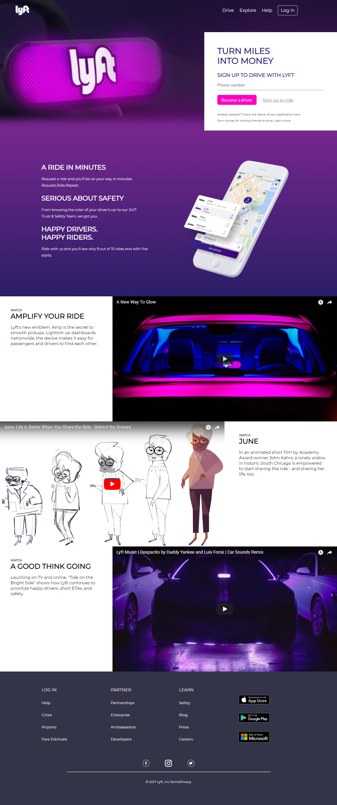

# Lyft
O objetivo é a reprodução da página de um aplicativo interativo chamado Lyft.

## Fluxo do projeto: 
Utilizar arquivos HTML, CSS e de imagens para replicar o website. Inseridos também ícones do Font Awesome e iframe do Youtube.

Os vídeos que foram usados, são:

* https://www.youtube.com/embed/fLSmUWOYpKw
* https://www.youtube.com/embed/V7j8Aqxmbs8
* https://www.youtube.com/embed/hWYQvs6UrPs

## Aparência:

Obs. Projeto corresponde a versão anterior do site Lyft, conforme aparência acima. Caso verifique o site atual, já consta novo design. 

## Considerar:

* Estrutura de pastas e arquivos
* Nome das classes e ids
* Indentação

